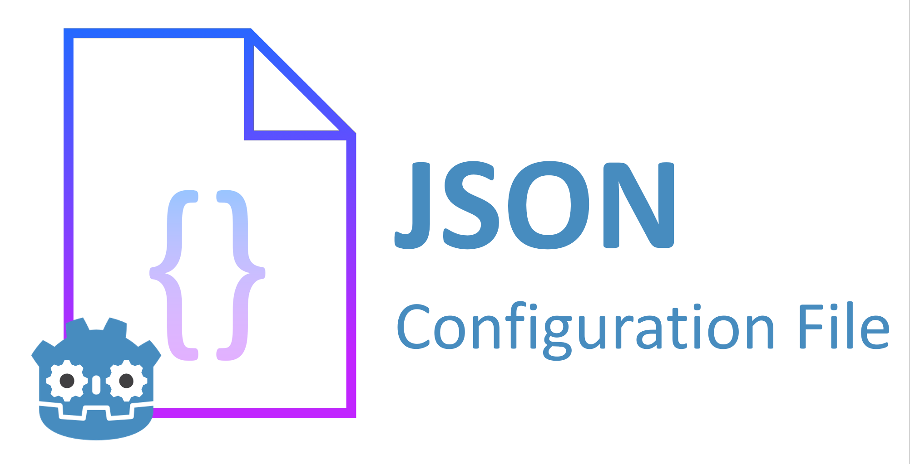
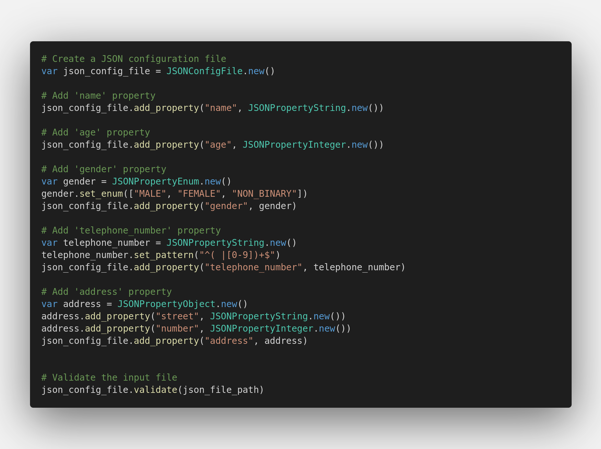
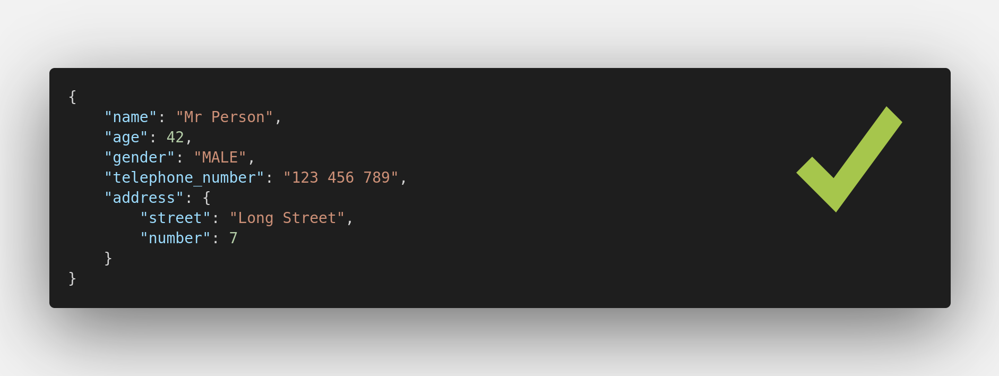
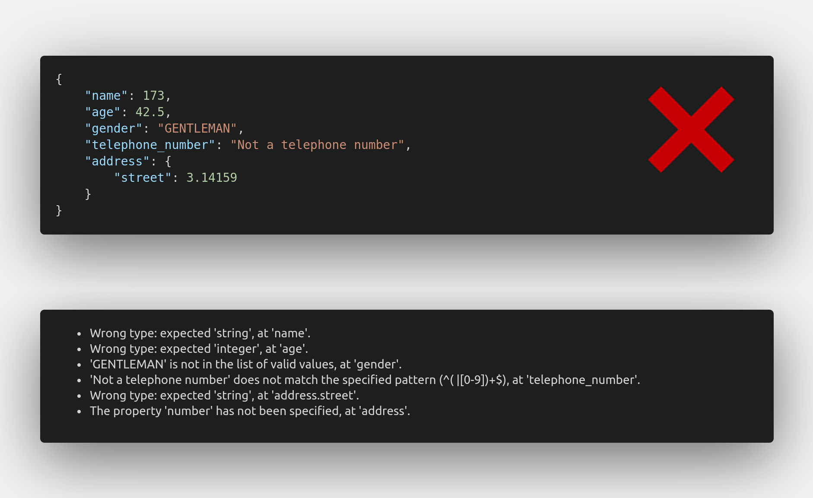

# JSON Configuration File

JSON Configuration File is a plugin for Godot that aims to aid reading user input via a JSON file. Using a JSON file as a way to configure your Godot application would allow your users to share configuration files. Minecraft is a remarkable example that uses JSON files to configure certain aspects of the game, such as block models.

The definition of JSON Schemas inspired this plugin. However, instead of using a JSON file to define the structure of a JSON, it takes a coding approach. This approach has the advantage of allowing more features.

## Code example

When using this plugin, you would be able to set up a configuration file with code like this:

This code would verify that this JSON file is valid:

And it would also detect multiple errors in this JSON file with a single validation process:

Please, check the [documentation](./doc/README.md) to learn how to set up your own JSON configuration file.

## Features

This plugin would offer you:
- Twelve different types of properties:
    - Booleans
    - Real numbers
    - Integers
    - Percentages
    - Strings
    - Enums
    - Arrays
    - Colors
    - Objects
    - Files
    - JSON Configuration Files
    - Images
- The ability to detect multiple errors and warnings with a single call to the validation process.
- A representation of the errors and warnings with dictionaries to allow customization of the messages.
- The execution of code during the validation process to transform the data or to create custom tests.

## Contributing

If you want to contribute with a new kind of property or a new feature, please consider also contributing to the [documentation](./doc/README.md) or adding new tests to the [repository of tests](https://github.com/98teg/JSONConfigFileTests) for this plugin.
