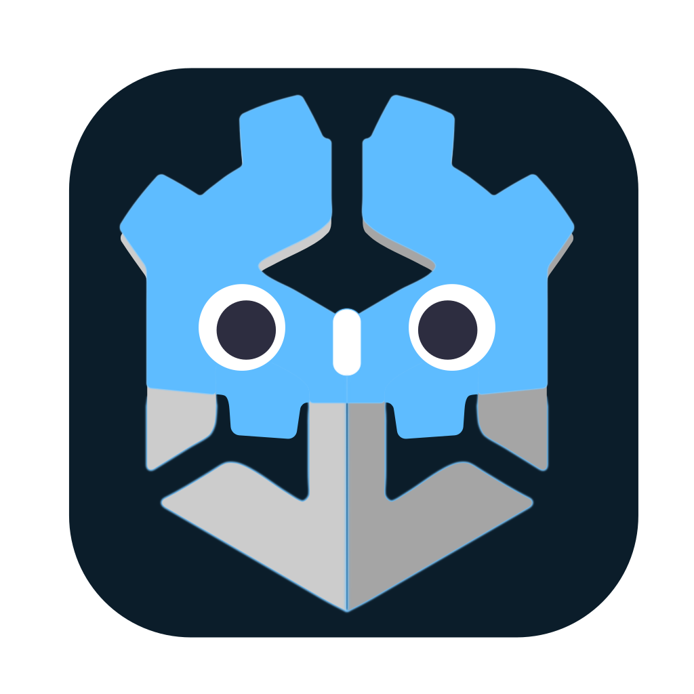
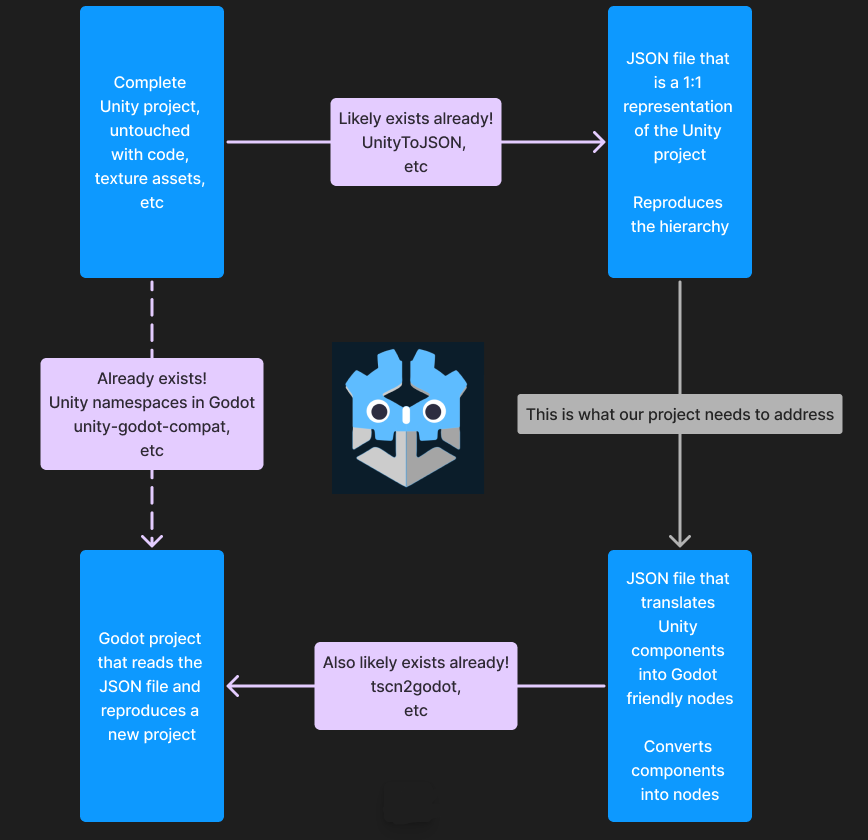

# Unity to Godot Toolkit Converter

Provided is a set of tools meant to take a Unity project and prepare its assets for Godot imports. The repo was recently updated to use submodules and may introduce breaking changes to old projects. In order to download each tool, follow these steps:

1. Clone this repository: `git clone https://github.com/Anthogonyst/UnityToGodot.git`
2. Initialize and download the submodules: `git submodule update --init --recursive`

## Motivation

Unity announced on 9/12/2023 that they will start charging free to play game developers by the number of downloads by 2024. They later revised a series of claims and mishaps to move to a pay per download model that ultimately shut down alot of progress in the games industry. As a result of their unstable business model, this repository aggregates some tools to help transition Unity engine projects into Godot engine instead.

## Contributing

Please fork, send PRs, and use discussions to debate on what kind of tools we need to make this possible and feel free to add them as a submodule. This will enable the most up-to-date downloads possible and keep track of where to find the original develoeprs.

Additionally, we have the following graphic as a more general roadmap.

# Credits

Thank you Beryesa for the logo design!
