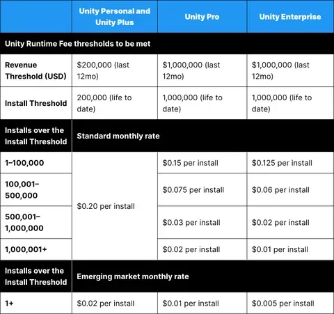
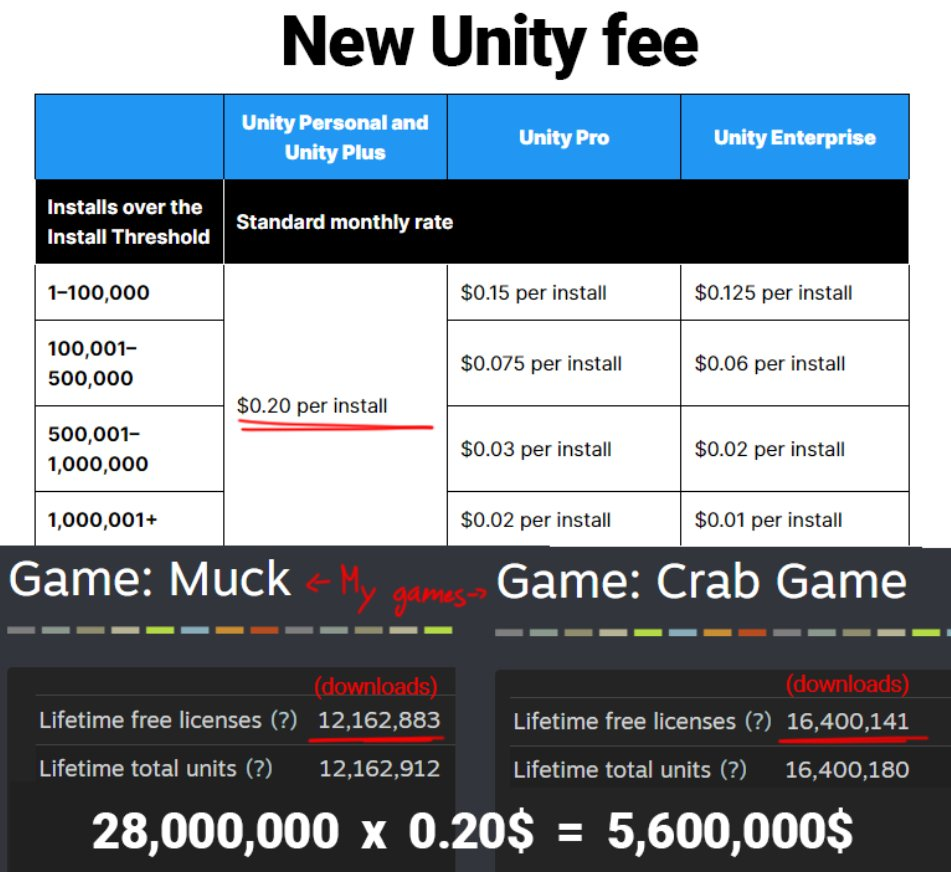

# Unity to Godot Total Project Converter

New Discord:  https://discord.gg/uYcpkQBvP5

This is a call to action for game developers everywhere. Unity announced on 9/12/2023 that they will start charging free to play game developers by the number of downloads by 2024. This means that many free games that exist will no longer be able to run and most of them will shut down. 
 

For comparison's sake, this threat is so serious that some free games such as Crab Game made by @DaniDevYT will owe millions of dollars. This is deeply impactful and we may see many games disappear.

Let's do everything we can to aid game developers that have projects to migrate them to Godot. Godot is an open source game engine that promises to never charge licensing fees. Godot is driven by open source contributions and will therefore help us survive.

# Contributing

Given how recently this happened, we have some json libraries but none of the tests or connecting pieces to make it all happen. We need you to help us! Please fork, send PRs, and use discussions.

Our developers from the discord have come up with this roadmap so far:  https://github.com/users/Anthogonyst/projects/1/views/1

Additionally, we have the following graphic as a more general roadmap.

# Credits

Thank you Beryesa for the logo design!
